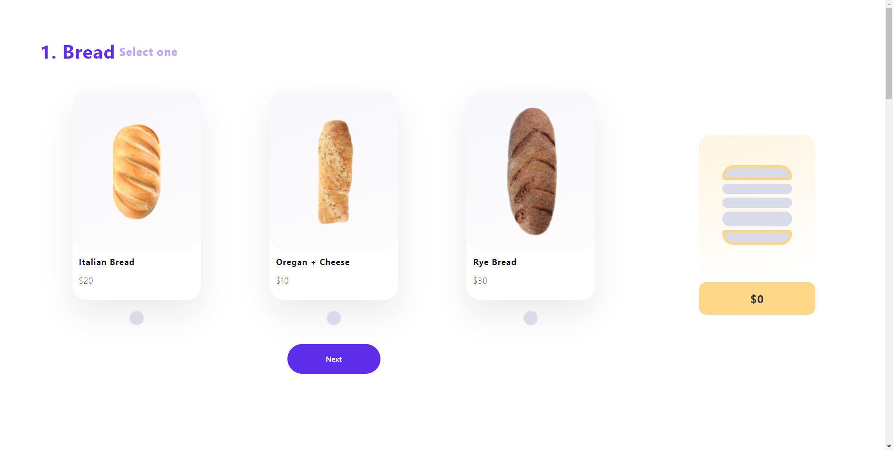
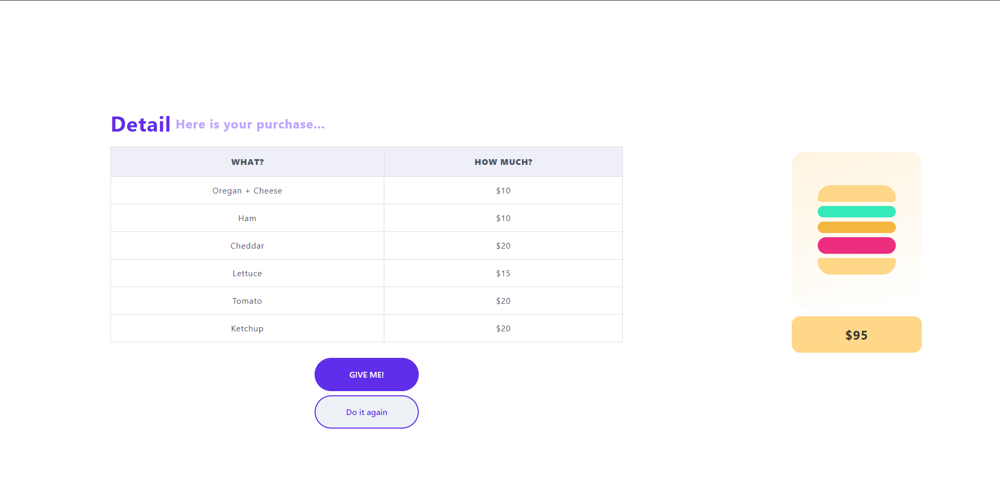

# Demo
[Sambuche App](https://sambuche.netlify.app/)

# Sambuche App

Es una pagina que simula el armado de un pedido de Sandwichs, a traves de diferentes pasos en los que se selecciona el tipo de pan, el tipo de carne, etc. Cuando se finaliza la orden se muestra los ingredientes elegidos y el precio total, alli se podra completar el pedido o volver a armarlo.

## Diseño

Esta basada en este diseño de figma: [link](https://www.figma.com/file/KnxP9nTRct944dPESHPz1M/MySambuche-App?node-id=0%3A1)

## Screenshots

